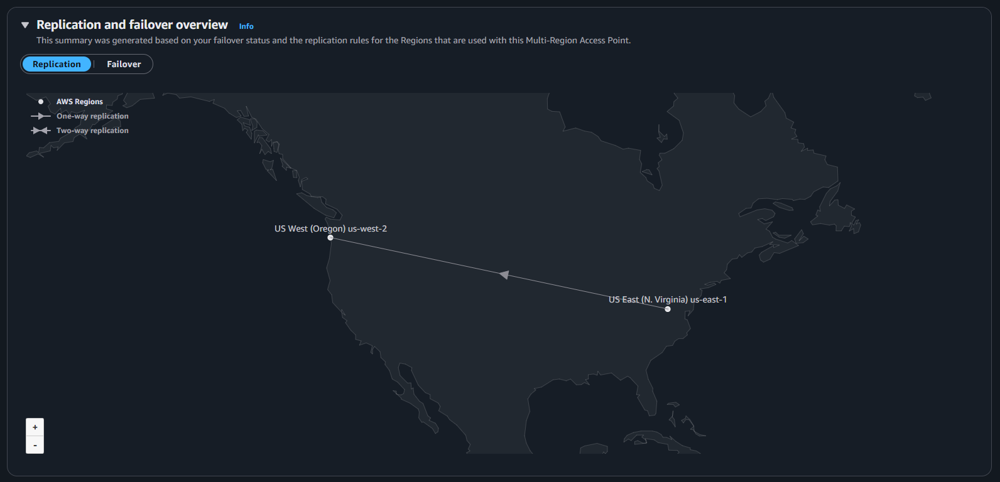
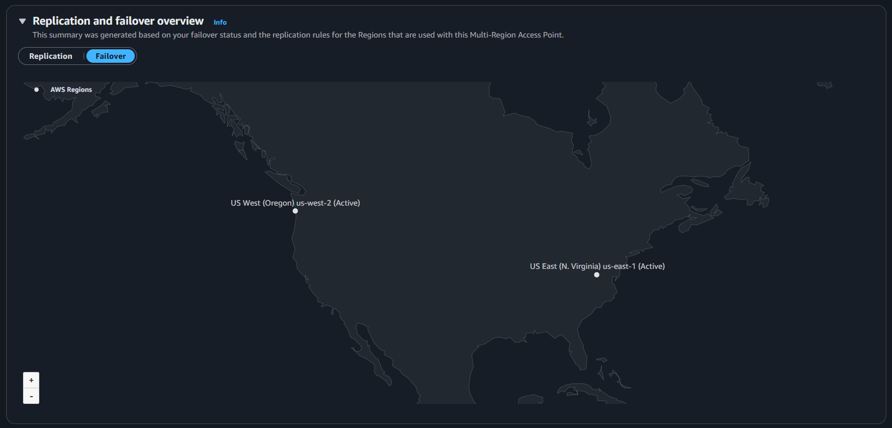
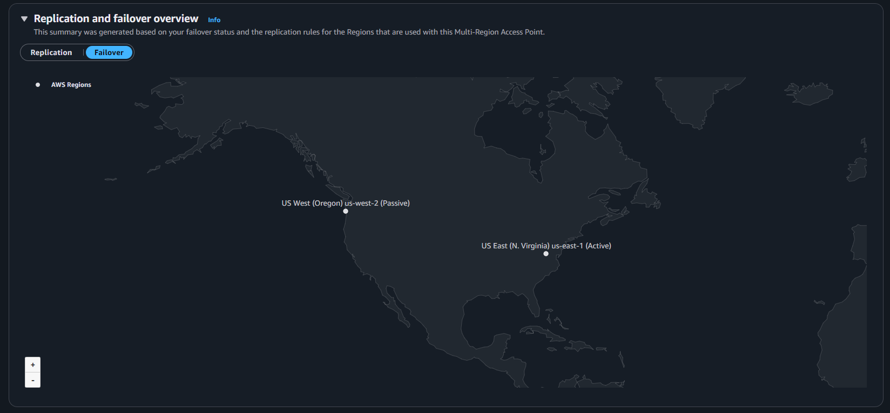

---

## Multi-Region Access Point (MRAP) Deployment Failure (v1.0)

***

### **Project Goal**

To transition the static website hosted in the `silvanx.com` S3 bucket from a simple regional CRR setup to a highly resilient **Active/Passive Multi-Region Architecture** using AWS S3 Multi-Region Access Points (MRAP) and CloudFront.

The goal was to provide a single, global endpoint (`https://www.silvanx.com/`) with automatic regional failover capability using a cost-optimized Disaster Recovery (DR) bucket (`silvanx.com-dr`).

### **Cloud Architecture**

| Component | Status | Purpose |
| :--- | :--- | :--- |
| **S3 Primary Bucket** | `silvanx.com` (`AWS_REGION_1`) | Holds primary, active website data. |
| **S3 DR Bucket** | `silvanx.com-dr` (`AWS_REGION_2`) | Holds replicated data (via CRR) for disaster recovery. |
| **CRR** | Configured | Ensures new objects are replicated to the DR bucket. |
| **MRAP** | Deployed (`mx45zumotc7ju.mrap`) | Provides a single global endpoint for CloudFront. Configured for **Active/Passive** routing. |
| **CloudFront** | Updated (`CF_DISTRIBUTION_ID`) | Provides global CDN caching, HTTPS, and uses the MRAP as its origin. |

#### **Replication and Failover Configuration**

**Cross-Region Replication (CRR)** setup, ensuring data moves from primary bucket in **US East (N. Virginia) us-east-1** to your DR bucket in **US West (Oregon) us-west-2**.

A temporary configuration was tested with both regions set to **Active**.

Configured for **Active/Passive** routing, with **US East (N. Virginia) us-east-1** as **Active** and **US West (Oregon) us-west-2** as **Passive**.

---

### **Deployment Steps and Critical Errors**

The MRAP was successfully created and configured, but connecting CloudFront was blocked by a fundamental security conflict.

| Step | Action Taken | Result | Error/Resolution |
| :--- | :--- | :--- | :--- |
| **1. Create MRAP** | Created `silvanx-mrap-2` with Alias `mx45zumotc7ju.mrap`. | Success. | Set routing to **Active** (`AWS_REGION_1`) / **Passive** (`AWS_REGION_2`). |
| **2. Clean Public Access** | **Initial Failure:** Found `silvanx.com` had **Static Website Hosting** enabled and a public Bucket Policy. | Fixed. | **Resolution:** Deleted the public bucket policy and disabled static website hosting to make the bucket private. |
| **3. Configure CloudFront Origin** | Updated CloudFront Origin Domain to the MRAP Hostname: `mx45zumotc7ju.mrap.s3-global.amazonaws.com`. | Success. | **Resolution:** Removed the `/SilvanX_Website` value from the **Origin Path** field and set the **Default Root Object** to `index.html`. |
| **4. Final Connection Attempt** | After fixing all configuration and policy errors, the site returned: **`ERROR: Failed to contact the origin.`**. | Failure. | **Diagnosis:** The MRAP requires **SigV4A** authentication, which the CloudFront Custom Origin type cannot natively provide, resulting in a persistent authentication failure. |

---

### **Rollback and Validation**

Due to the persistent authentication failure, the Multi-Region setup was safely reverted to the original regional configuration to maintain website availability.

* **Rollback Action:** The CloudFront origin was changed back to the **original S3 REST API endpoint** (`silvanx.com.s3.amazonaws.com`).
* **Validation 1 (CloudFront):** The `https://www.silvanx.com/` domain was successfully tested and verified to be serving content globally.
* **Validation 2 (CI/CD):** The connection between the GitHub repository and the S3 bucket was tested and verified to be automatically deploying new changes successfully.

---

### **What I Learned**

For a private S3 Multi-Region Access Point to function as a CloudFront Custom Origin, a code solution is required to satisfy the **LAMBDA SigV4A** signature requirement. Simple policy configurations alone are insufficient for this specific cross-service security model.

***

### **Future: Completing the MRAP**

This project will be revisited once I learn more about Lambda and serverless computing.

***
